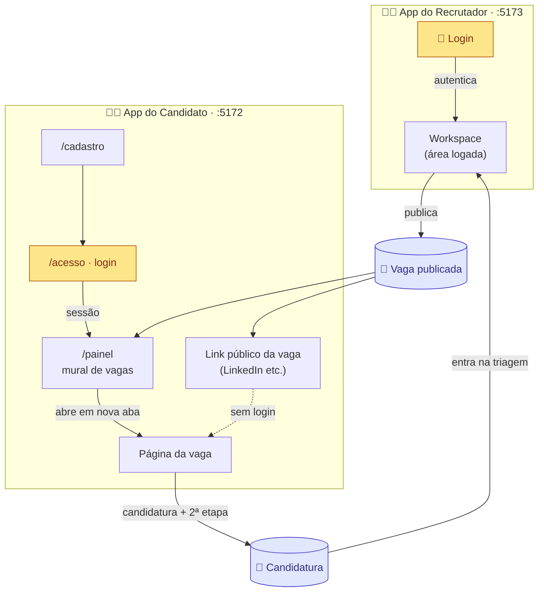
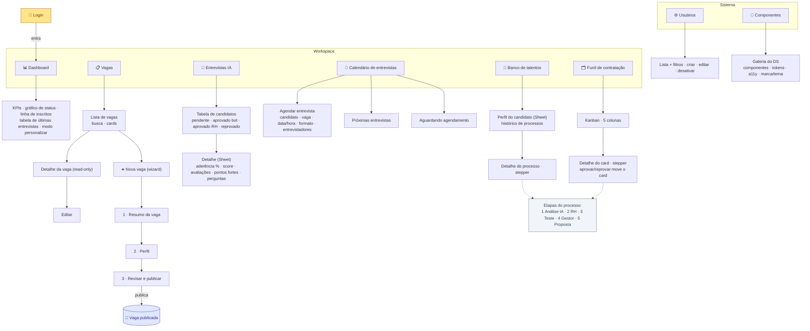
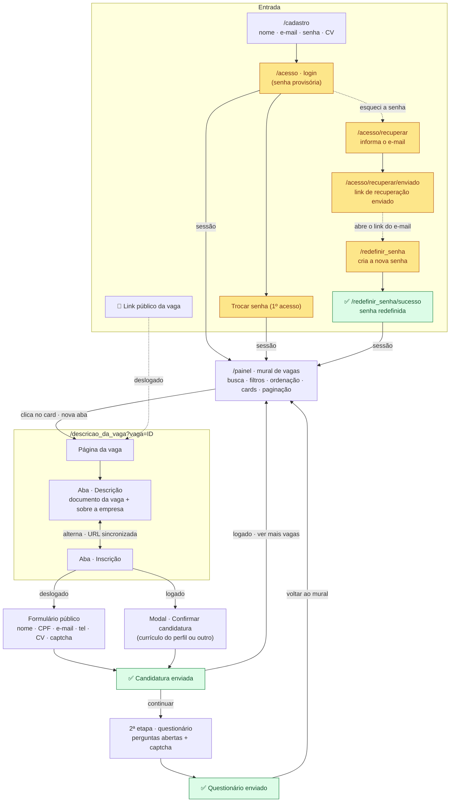
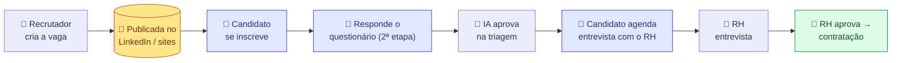

# Arquitetura de Informação — TalentAI (crp_ds)

> Mapa visual da **plataforma inteira**: o app do **recrutador** (porta dev `:5173`) e o app do
> **candidato** (porta dev `:5172`). Mesma plataforma, mesmo Design System / tokens / i18n — duas
> origens separadas porque atendem públicos diferentes (o "lado de dentro" e o "lado de fora").
>
> Mockup de propósito: sem backend. As rotas do candidato são por `pathname`; as "rotas" do
> recrutador são `views` em abas (estado em `localStorage:crp.view`).

---

## 1. Visão geral — o ciclo de valor

O recrutador **cria e publica** a vaga; o candidato a **encontra e se candidata**; a candidatura
**volta** para o funil de triagem do recrutador. É um loop entre os dois apps.

---

## 2. App do Recrutador (`:5173`)

Login → Workspace. A navegação é por abas (`App.tsx`). Menu agrupado em **Workspace** e **Sistema**
(rótulos exatos de `i18n/nav.json`).

---

## 3. App do Candidato (`:5172`)

Rotas por `pathname` (`CandidatoApp.tsx`): `/acesso`, `/cadastro`, `/painel` e o resto cai na
**página da vaga**. A 2ª etapa e as abas Descrição/Inscrição são estados internos (a URL é
sincronizada via History API).

### Chrome por área
- **Telas públicas** (vaga, 2ª etapa): header leve (logo) + dock flutuante (idioma / marca / tema).
  Com sessão, o logo vira link para `/painel` e aparece a conta (avatar + sair).
- **Área logada** (`/painel`): topbar própria (logo + idioma/marca/tema + conta).

---

## 4. A jornada completa (da criação à contratação)

O funil de ponta a ponta, cruzando recrutador → publicação externa → candidato → triagem por IA → RH.

---

## Legenda

| Forma / cor | Significado |
|---|---|
| 🔐 Caixa âmbar | Gate de autenticação |
| `[(cilindro azul)]` | Dado/estado que cruza os apps (vaga publicada, candidatura) |
| ✅ Caixa verde | Estado de sucesso/conclusão |
| Seta cheia `-->` | Navegação direta |
| Seta pontilhada `-.->` | Acesso condicional / referência |
| `<-->` | Alternância (abas) |

## Notas
- **Sem backend** (mockup). Sessão do candidato em `localStorage` (`candidato.email`), compartilhada
  entre abas (a vaga abre em nova aba e precisa saber que há sessão).
- As **etapas do processo** (Análise IA → RH → Teste → Gestor → Proposta) são as mesmas no Funil
  (kanban) e no Banco de talentos (stepper do processo).
- Multi-marca (CRP / Trevo) × claro/escuro, i18n pt-BR/en/es, WCAG 2.2 AA.
